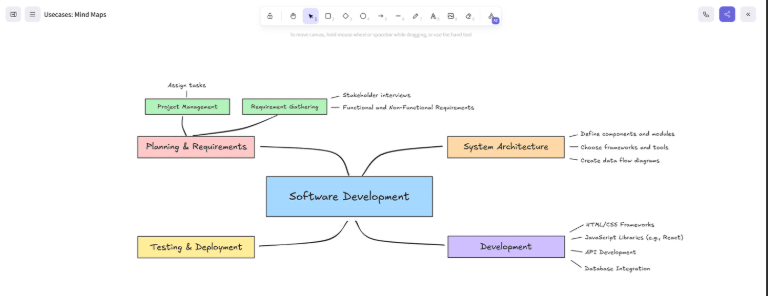
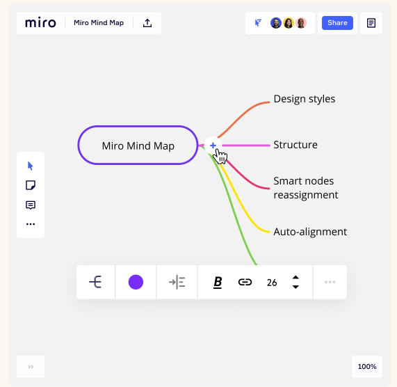
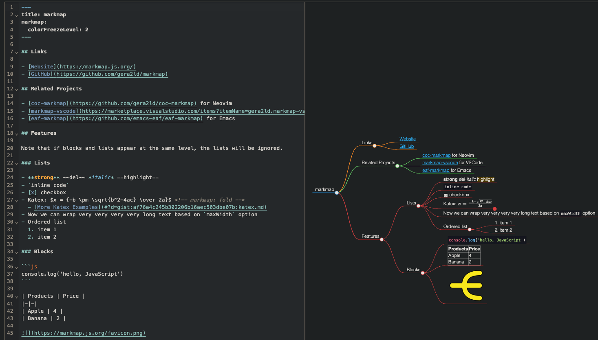
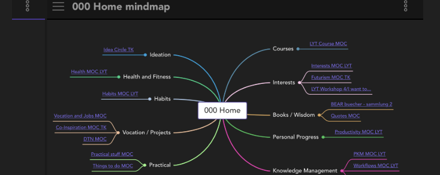
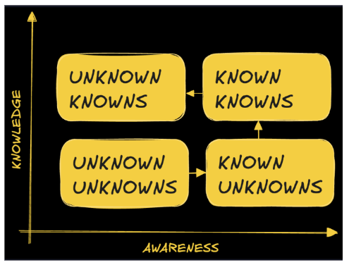

# tooling do mindmap / notatek

(na samym dole: _jak używać mind map? (subiektywne spojrzenie)_)

## git

- [git jaki jest, każdy widzi](https://pl.wikiquote.org/wiki/Ko%C5%84_jaki_jest,_ka%C5%BCdy_widzi)
  - trzymaj gdzie chcesz, klonuj, historia... po prostu git
- dobry do notatek, ale nie do mindmap

## [text-to-speech: SuperWhisper](https://superwhisper.com/)

- nie pisz wszystkiego ręcznie :) dyktuj!
  - na poziomie UI systemu operacyjnego wybierasz np. edytor tekstu, skrót klawiszowy -> nagrywasz, dyktujesz -> znowu skrót klawiszowy -> masz tekst w edytorze
  - model nieźle łapie interpunkcję
  - zawahania i zwieszki (podczas naturalnego ludzkiego mówienia) są automatycznie "wyprostowywane", +-korekta w locie
  - dyktowanie przez superwhisper np. do perplexity działa _lepiej_ niż natywny "dyktafon" perplexity
- free/PRO
  - free: model anglojęzyczny, bardzo good-enough
  - lepsiejsze modele płatne, w tym nie-anglojęzyczne
  - 15 minut PRO darmowo na zachętę
- mac only (?)
- integracja z LLMami (!)
  - w ramach PRO
  - działanie:
    - dyktujesz
    - tekst przepuszczany do LLMa
    - (możesz dodać custom prompty, cuda wianki)
    - to co trafia do edytora jest odpowiedzią z LLMa
- [TUTORIAL: superwhisper](https://www.youtube.com/watch?v=h_A3bOtyihk)

## [excalidraw](https://excalidraw.com/)

- online edytor, OSS, free
  - offline w formie apki electron
- [VSCode extension](https://marketplace.visualstudio.com/items?itemName=pomdtr.excalidraw-editor)
- GRAFICZNY (textowo nie wyedytujesz)
- import/export do pliku .excalidraw
  - można trzymać w repo
- trzyma dane w LocalStorage przeglądarki (!)
  - istnieje upper limit na rozmiar, ALE raczej go nie osiągniesz ;)
- wyklikując nowy board (np. z poziomu incognito) i współdzieląc masz nowy board z nowym limitem
  - dostajesz unikalny hash (permalink), do tej pory
  - użyteczne jeśli chcesz mieć tematyczne mind mapy
- gdyby ktoś chciał, [można nawet zaembedować](https://www.npmjs.com/package/@excalidraw/excalidraw) we własnym frontendzie
- [TUTORIAL: excalidraw mindmap](https://www.youtube.com/watch?v=JLZVnWwE-H8)
- [biblioteki ikon do excalidraw](https://libraries.excalidraw.com/?theme=light&sort=default)

## [miro](https://miro.com/)

- online collab
- 3 boardy za free
- prawd. najpopularniejsze rozwiązanie stosowane przy sesjach event stormingowych
- [TUTORIAL: miro mindmap](https://www.youtube.com/watch?v=PFm3KGGqfsk)

## [markmap](https://markmap.js.org)

- markdown, git-friendly, OSS
- TEXT-BASED
- [online editor](https://markmap.js.org/repl)
- [VSCode extension](https://marketplace.visualstudio.com/items?itemName=gera2ld.markmap-vscode)
- export do HTML
- [MINI-TUTORIAL: markmap mindmap](https://www.youtube.com/watch?v=8MwQtoF2yak)

## [obsidian](https://obsidian.md/) 

- ograniczone features we free tier
  - w płatnym planie sync across devices, collab, etc.
- "vault" - folder na pliki/dokumenty
  - (nie mylić z HashiCorp vault 😉)
  - notatki - markdown-formatted plain text files
  - linkowanie notatek/dokumentów absurdalnie proste
  - linked/unlinked mentions
  - każdy "vault" zarządzany osobno
  - i wiele innych, to cały ecosystem
- bogaty plugin ecosystem
  - [excalidraw plugin](https://forum.obsidian.md/t/excalidraw-full-featured-sketching-plugin-in-obsidian/17367)
    - pozwala embedować pliki Excalidraw w Notatkach
    - pozwala embedować notatki w plikach Excalidraw z "vault"
    - pozwala linkować poszczególne node'y mind mapy do notatek
  - [markmind plugin](https://github.com/MarkMindCkm/obsidian-markmind)
  - i wiele innych
- [TUTORIAL: obsidian mindmap](https://www.youtube.com/watch?v=IVF_x5rdhoo)

(markmind plugin poniżej)

(bo excalidraw plugin to po prostu excalidraw 😉)

---

# jak używać mind map? (subiektywne spojrzenie)

TL;DR; _**mindmapa jest dla mnie punktem wyjścia do dalszej drogi, nie "produktem"**_

- DISCLAIMER: _**każdy ma inny układ neuronalny**_ 😉 i dla każdego optymalne może być coś innego. To co mi odpowiada Tobie może - ale nie musi 😉
- używam mindmap do **porządkowania i strukturalizowania wiedzy**, zwłaszcza jeśli koncept jest dla mnie nowy/mało znany
  - mindmapy świetnie pomagają mi wyjść z obszaru _unknown unknowns_ i przejść do _known unknowns_ (wyżej też by się nadawały - kwestia preferencji)
  - jeśli koncept jest znany i wchodzę w szczegóły/niuanse/detale (_known knowns_), to albo kod, albo rysowanie (papier, excalidraw)
- największą **wartością mindmapy** jest Twoja praca włożona w jej **usystematyzowanie**, bo to wymaga pracy Twojego mózgu ([myślenie dywergentne, emergentne, konwergentne](https://www.charlesleon.uk/blog/3-thinking-modes-of-creative-thinking-divergent-emergent-and-convergent-thinking24112019) itp 😉). To Ty sobie w głowie układasz, jak temat X łączy się z Y. Mindmapa jako "artefakt" ma dla mnie pomniejsze znaczenie (choć dla Ciebie może być inaczej).
- ja wręcz zajeżdżam czy to perplexity/gemini (ogólniej: **modele klasy deep research**) masową ilością szybkich/krótkich pytań, które potem nierzadko usuwam.
  - Większość moich promptów zawiera dopiski typu "_odpowiedz mi krótko, w max 1-2 zdaniach_" (także bullet point listy/podsumowania mają takie dopiski), bo **czas mojego/Twojego czytania też ma znaczenie** 😉 LLMy lubią lać wodę - a ja chcę konkret i chcę go szybko. Czytanie historii snutych od początku świata wraz z całym kontekstem (to co LLM lubi robić) jest bardzo czasochłonne.
  - Interesuje mnie konkretna odpowiedź na konkretne pytanie - ale SPECYFICZNE - i często "deep research" nawet nie jest potrzebny. Zwłaszcza jeśli chodzi o koncept, a nie o konkretny kod do narzędzi w konkretnych wersjach itp (tam lepiej deep research).
  - pytania-jednorazówki usuwam, bo przydatne jest dla mnie **efektywne wyszukiwanie wcześniejszych promptów/odpowiedzi**
- w efekcie jak wracam do mindmapy po roku czy 2 czy 5, to mam inne (dojrzalsze) patrzenie na temat. Siłą rzecz, no shit sherlock. I "nie boli" mnie że się zdezaktualizowała. Bo **wartość jaką wniosła to moje rozumienie** - to ja syntezowałem wiedzę, ja ją sobie uporządkowałem, to moje rozumienie - a nie sru "dziesiątki linii kodu na slajdzie" które nie wiem skąd się wzięły.

tak czy siak, **każdy ma inaczej** - ale warto poeksperymentować. Siłą rzeczy każde z ww. narzędzi na odpowiednim etapie "podpatrzyłem" u kogoś.
